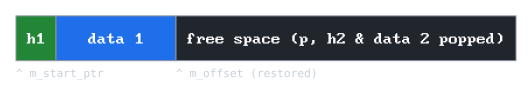
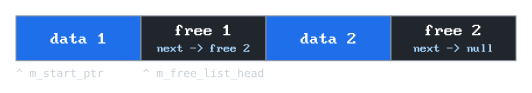

# oo-alloc

A collection of custom C++ allocators.

## Introduction

Custom allocators are tightly coupled with certain 
data structures, access patterns and object lifetimes. 
Just like choosing the right data structure,
picking the correct allocation strategy can grant noticeable performance gains.
Each allocator comes with its own quirks: 
different time complexities, memory overheads and optional constraints.
It is crucial to pick the right tool for the job. 
The overview available below can help you do exactly that.

## Overview

| Type          | `alloc`    | `free`     | `clear`   | `realloc`   | Overhead | Best for          | Constraints         |
| :---          | :---:      | :---:      | :---:     | :---:       | :---:    | :---              | :---                |
| **Arena**     | *O(1)*     | *N/A*      | *O(1)*    | *O(1)**     | OB       | Bulk allocations  | No individual frees |
| **Stack**     | *O(1)*     | *O(1)**    | *O(1)*    | *N/A*       | ~8B      | Temporary data    | Strict LIFO         |
| **Pool**      | *O(1)*     | *O(1)*     | *O(1)*    | *N/A*       | 0B       | Identical objects | Fixed sizes         |
| **Free List** | *O(n)***   | *O(n)***   | *O(1)*    | *O(n)***    | 16B+     | General purpose   | Fragmentation (in)  |
| *Buddy****    | *O(1)*     | *O(1)*     | *O(1)*    | *O(1)*      | 0B       | OS memory         | Fragmentation (ex)  |
| *Slab****     | *O(1)*     | *O(1)*     | *O(1)*    | *N/A*       | OB       | Object caching    | Single type         |

<sub>\*You can only operate on the top-most allocation.</sub><br>
<sub>\*\*Using a size segregated free-list (size buckets) implementation, it's possible to achieve *O(1)* time complexity.</sub><br>
<sub>\*\*\*Not yet available in this repository (in development).</sub>

## Implementation

### Arena (linear) allocator

The simplest allocator.
It keeps a pointer to the starting address of the large, contiguous block allocated on `init`.
Also stores an `m_offset` integer, which holds the relative position of the last allocated memory from the pointer.

Each time `alloc` is called, size of said allocation is added to the `m_offset`.
Minimal fragmentation is achieved due to the sequential allocation - the only space wasted is used for alignment.

#### Internal structure

```cpp
class ArenaAllocator {
private:
  void*       m_start_ptr;
  std::size_t m_total_size;
  std::size_t m_offset;

public:
  void* alloc(std::size_t size, std::uint8_t align);
  bool  init(std::size_t size);
  void  clear();
};
```

When `alloc` is called, it calculates the memory alignment, adds the requested `size` plus the alignment to the `m_offset`, and returns the previous address.
This makes `alloc` an instant *O(1)* operation.

Because it only tracks a single forward-moving offset, you can't free individual objects.
You can only clear the entire arena, which is done by resetting `m_offset` to zero, resulting in a *O(1)* `clear` time complexity.

<p align="center">
  
  <br>
  <em><sub>Arena allocator after two allocations. The offset points to the start of the free space.</sub></em>
</p>

<p align="center">
  
  <br>
  <em><sub>Arena allocator after clear() is called. It holds no data.</sub></em>
</p>

### Stack allocator

As the name suggests, it treats the memory as a stack. 
It builds upon the Arena allocator. 
Contrary to the Arena, it supports individual `free` operations, but due to the strict Last-In First-Out (LIFO) restrictions, you can only "pop" the most recently allocated element. 

Its definition is practically identical to the arena allocator, but it has an additional method `free`.
What differs is that each allocated block has a header before it, which stores the previous `m_offset`.


#### Internal structure

```cpp
class StackAllocator {
private:
  void*       m_start_ptr;
  std::size_t m_offset;
  std::size_t m_total_size;

public:
  void* alloc(std::size_t size, std::uint8_t align);
  void  free(void* ptr);
  bool  init(std::size_t size);
  void  clear();
};
```

When `alloc` is called, the allocator calculates the required padding for alignment, reserves space for both the header and the requested `size`, and writes the previous `m_offset` into the header just behind the returned pointer. This makes `alloc` an instant *O(1)* operation.

On `free`, the allocator simply reads the header immediately before the given pointer and restores `m_offset` to the value stored in it, hence deallocating the block. Since we don't need to search for the data, it's also an *O(1)* operation.

<p align="center">
  
  <br>
  <em><sub>Stack allocator after two allocations. The hidden headers (h1, h2) are placed immediately before the user data.</sub></em>
</p>

<p align="center">
  
  <br>
  <em><sub>After calling free() on data 2, the allocator reads h2 and instantly snaps m_offset back to the end of data 1.</sub></em>
</p>

### Pool allocator

It's a very limited, but exceptionally fast and simple allocator.
It works by dividing up its entire memory block into equally sized segments, reffered to as **chunks**.

To track free memory, it uses a singly linked list.
To achieve zero memory overhead, it uses a intrusive list. 
It stores the "next" pointer directly inside the free chunks themselves. 
When a chunk is free, it acts as a list node. 
When it is allocated, that pointer is overwritten by the users data.

#### Internal structure

```cpp
class PoolAllocator {
private:
  std::size_t m_chunk_size;
  std::size_t m_chunk_align;
  void*       m_start_ptr;
  std::size_t m_total_size;
  void*       m_free_list_head;

public:
  void* alloc(std::size_t size, std::uint8_t align);
  void  free(void* ptr);
  bool  init(std::size_t size);
  void  clear();
};
```

When `alloc` is called, it pops the `m_free_list_head`, updates the head to point to the next free chunk in the list, and returns the popped address.
Since there is no list traversal required, this is an instant *O(1)* operation.

On `free`, it casts the passed `ptr` into a list node, sets its "next" pointer to the current `m_free_list_head`, and then updates `m_free_list_head` to point to `ptr`. This frees the chunk in *O(1)* time.

<p align="center">
  
  <br>
  <em><sub>Pool allocator in a fragmented state. The free chunks store "next" pointers directly inside their empty space.</sub></em>
</p>

<p align="center">
  
  <br>
  <em><sub>After calling free() on data 1, it gets pushed to the front of the intrusive linked list. The head pointer is updated in O(1) time.</sub></em>
</p>

### Free list allocator

It's a general purpose allocator, that is widely used under the hood for heap memory management.
It gained its popularity due to it having essentially no restrictions. 
It's implementation and performance may vary greatly, based on the level of complexity:
- It achieves *O(n)* `alloc`/`free`/`realloc` with a singly-linked or doubly-linked list implementation,
- It achieves *O(log n)* `alloc`/`free`/`realloc` with a Red-Black tree implementation,
- It achieves (mostly) *O(1)* `alloc`/`free`/`realloc` with a size-segregated (bucketed) implementation.

The implementation below uses a **singly-linked** list to store addresses of free memory blocks.
The list is sorted by memory address (ascending), and is intrusive, just like in the Pool allocator.
What differs, is that compared to the Pool allocator, the free block stores more data. 
It stores `size` of the free data, and the address to the next free block.

When a chunk of memory is allocated, it is prefixed with a `AllocHeader`, which holds the `size` and `pad`, required to align the data.

#### Internal structure

```cpp
class FreeListAllocator {
private:
  struct FreeBlock {
    std::size_t size;
    FreeBlock *next;
  };
  struct AllocHeader {
    std::size_t size;
    std::uint8_t pad;
  };
  void*       m_start_ptr;
  std::size_t m_total_size;
  FreeBlock*  m_free_list_head;

public:
  void* alloc(std::size_t size, std::uint8_t align);
  void  free(void* ptr);
  bool  init(std::size_t size);
  void  clear();
};
```

When `alloc` is called, it traverses through the list of free blocks, picking one matching the wanted size the closest (**best-fit**), or the first that can contain the memory to allocate (**first-fit**), and allocates the data with the hidden header before it. 
Due to the required list traversal, the time complexity is *O(n)*.

When `free` is called, reads the `size` and `pad` from the hidden header, and casts the memory back into a `FreeBlock`.
To prevent external fragmentation, it then **coalesces** neighboring free memory blocks.

Coalescence is achieved by checking if the end of one free block perfectly touches the start of the next. 
If they touch, their sizes are summed together, and the second block is physically removed from the linked list. 
To prevent pointer invalidation bugs, it is best practice to always coalesce a block with its next neighbor before coalescing with its previous neighbor. 
Because finding the correct insertion point in the address-sorted list requires traversal, `free` also carries an *O(n)* time complexity.

## Roadmap

* [x] Implement a explicit free-list allocator.
* [ ] Add realloc functionality.
* [ ] Move free-list allocator to a size buckets implementation.
* [ ] Implement a pow-of-two buddy allocator.
* [ ] Write a description for each allocator.
* [ ] Benchmark cache misses via perf.
* [ ] Implement a slab allocator.

## Sources

* [Linear Allocator from Nicholas Frechette's Blog](https://nfrechette.github.io/2015/05/21/linear_allocator/)
* [Writing My Own Malloc in C by Tsoding](https://youtu.be/sZ8GJ1TiMdk?si=j0XnG7UxBTVji-NJ)
* [mtrebi's memory-allocators repository](https://github.com/mtrebi/memory-allocators)
* [gingerBill's Memory Allocation Strategies - Article Series](https://www.gingerbill.org/series/memory-allocation-strategies/)
* [CS107 - Explicit Free List Allocator, Stanford University](https://web.stanford.edu/class/archive/cs/cs107/cs107.1246/lectures/24/Lecture24.pdf)
* [MallocInternals from glibc wiki](https://sourceware.org/glibc/wiki/MallocInternals)
* [Slab allocation Wikipedia page](https://en.wikipedia.org/wiki/Slab_allocation)
