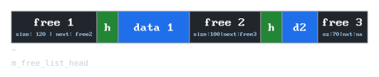
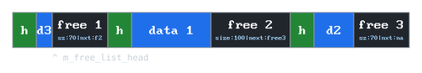
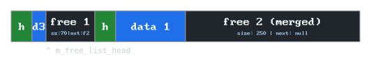
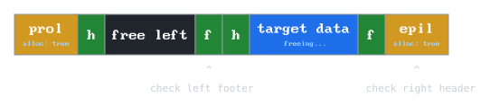

<div align="center">
  <picture>
    <source media="(prefers-color-scheme: dark)" srcset="docs/assets/header_dark.svg">
    <source media="(prefers-color-scheme: light)" srcset="docs/assets/header_light.svg">
    
  </picture>

  <p><em>A collection of custom C++ allocators.</em></p>

</div>

---

## Table of contents

- [Build & run](#build--run)
- [Introduction](#introduction)
- [Overview](#overview)
- [Implementation](#implementation)
  - [Arena (linear) allocator](#arena-linear-allocator)
  - [Stack allocator](#stack-allocator)
  - [Pool allocator](#pool-allocator)
  - [Free list allocator](#free-list-allocator)
  - [Free tree allocator](#free-tree-allocator)
  - [Tracking allocator](#tracking-allocator)
  - [Buddy allocator](#buddy-allocator)
  - [Slab allocator](#slab-allocator)
- [Roadmap](#roadmap)
- [Sources](#sources)

## Build & run
```bash
mkdir build && cd build
cmake ..

# build the static library (.a)
cmake --build . --config Release

# build and run performance benchmarks
cmake --build . --target run-benchmarks

# build and run individual tests
cmake  --build . --target test-arena 
# available: 
# test-arena, test-pool, test-stack, 
# test-free, test-track, test-rbtree, 
# test-tree, test-buddy, test-slab,
# test-all
```

## Introduction

Custom allocators are tightly coupled with certain data structures, access patterns and object lifetimes. 
Just like choosing the right data structure, picking the correct allocation strategy can grant noticeable performance gains.
Each allocator comes with its own quirks: different time complexities, memory overheads and optional constraints.
It is crucial to pick the right tool for the job. 
The overview available below can help you do exactly that.

## Overview

| Type             | `alloc`    | `free`     | `clear`   | Overhead | Best for          | Constraints             |
| :---             | :---:      | :---:      | :---:     | :---:    | :---              | :---                    |
| **Arena**        | `O(1)`     | *N/A*      | `O(1)`    | 0B       | Bulk allocations  | No individual frees     |
| **Stack**        | `O(1)`     | `O(1)`**   | `O(1)`    | ~8B      | Temporary data    | Strict LIFO             |
| **Pool**         | `O(1)`     | `O(1)`     | `O(1)`    | 0B       | Identical objects | Fixed sizes             |
| **Free List**    | `O(n)`     | `O(n)`     | `O(1)`    | ~16B     | General purpose   | Slow search / coalesce  |
| **Free Tree**    | `O(log n)` | `O(log n)` | `O(1)`    | ~32B     | General purpose   | High block overhead     |
| **Segregated***  | `O(1)`     | `O(1)`     | `O(1)`    | ~16B     | General purpose   | Complex to tune         |
| **Buddy**        | `O(1)`     | `O(1)`     | `O(1)`    | ~1-8B    | OS memory         | Fragmentation (in)      |
| **Slab**         | `O(1)`     | `O(1)`     | `O(1)`    | 0B       | Object caching    | Small objects           |

<sub>\*Not yet available in this repository (in development).</sub><br>
<sub>\*\*Freeing a specific block also frees all allocations made after it.</sub>

## Core interface

All allocators in this library inherit from the `IAllocator` base class. 
It defines a simple virtual interface for raw memory management and provides C++20 templates for type-safe object construction and destruction.

```cpp
class IAllocator {
public:
  // ...

  virtual void* alloc_raw(std::size_t size, std::size_t align) = 0;
  virtual void free_raw(void* ptr) = 0;
  virtual void clear() = 0;
  virtual std::size_t capacity() const = 0;

  // Handles object construction (placement-new)
  // and destruction. Calls 'alloc_raw'/'free_raw' internally.
  template<typename T, typename... Args>
  requires (!std::is_array_v<T>)
  T* make(Args&&... args);

  template<typename T>
  requires std::is_unbounded_array_v<T>
  std::remove_extent_t<T>* make(std::size_t count);

  template<typename T>
  void destroy(T* ptr);

  template<typename T>
  void destroy(T* ptr, std::size_t count);
};
```

## Implementation

### Arena (linear) allocator

The simplest allocator.
It keeps a pointer to the starting address of the large, contiguous block allocated on `init`.
Also stores an `m_offset` integer, which holds the relative position of the last allocated memory from the pointer.

Each time `alloc` is called, size of said allocation is added to the `m_offset`.
Minimal fragmentation is achieved due to the sequential allocation - the only space wasted is used for alignment.

#### Internal structure

```cpp
class ArenaAllocator {
private:
  void*       m_start_ptr;
  std::size_t m_total_size;
  std::size_t m_offset;

public:
  explicit ArenaAllocator(std::size_t size);
  ~ArenaAllocator();

  void* alloc_raw(std::size_t size, std::size_t align);
  void  clear();
  std::size_t capacity() const;
};
```

When `alloc` is called, it calculates the memory alignment, adds the requested `size` plus the alignment to the `m_offset`, and returns the previous address.
This makes `alloc` an instant *O(1)* operation.

Because it only tracks a single forward-moving offset, you can't free individual objects.
You can only clear the entire arena, which is done by resetting `m_offset` to zero, resulting in a *O(1)* `clear` time complexity.

<p align="center">
  
  <br>
  <em><sub>Arena allocator after two allocations. The offset points to the start of the free space.</sub></em>
</p>

<p align="center">
  
  <br>
  <em><sub>Arena allocator after clear() is called. It holds no data.</sub></em>
</p>

### Stack allocator

As the name suggests, it treats the memory as a stack. 
It builds upon the Arena allocator. 
Contrary to the Arena, it supports individual `free` operations, but due to the strict Last-In First-Out (LIFO) restrictions, you can only "pop" the most recently allocated element. 

Its definition is practically identical to the arena allocator, but it has an additional method `free`.
What differs is that each allocated block has a header before it, which stores the previous `m_offset`.

#### Internal structure

```cpp
class StackAllocator {
private:
  void*       m_start_ptr;
  std::size_t m_offset;
  std::size_t m_total_size;

public:
  explicit StackAllocator(std::size_t size);
  ~StackAllocator();

  void* alloc_raw(std::size_t size, std::size_t align);
  void  free_raw(void* ptr);
  void  clear();
  std::size_t capacity() const;
};
```

When `alloc` is called, the allocator calculates the required padding for alignment, reserves space for both the header and the requested `size`, and writes the previous `m_offset` into the header just behind the returned pointer. This makes `alloc` an instant *O(1)* operation.

On `free`, the allocator simply reads the header immediately before the given pointer and restores `m_offset` to the value stored in it, hence deallocating the block. Since we don't need to search for the data, it's also an *O(1)* operation.

<p align="center">
  
  <br>
  <em><sub>Stack allocator after two allocations. The hidden headers (h1, h2) are placed immediately before the user data.</sub></em>
</p>

<p align="center">
  
  <br>
  <em><sub>After calling free() on data 2, the allocator reads h2 and instantly snaps m_offset back to the end of data 1.</sub></em>
</p>

### Pool allocator

It's a very limited, but exceptionally fast and simple allocator.
It works by dividing up its entire memory block into equally sized segments, reffered to as **chunks**.

To track free memory, it uses a singly linked list.
To achieve zero memory overhead, it uses a intrusive list. 
It stores the "next" pointer directly inside the free chunks themselves. 
When a chunk is free, it acts as a list node. 
When it is allocated, that pointer is overwritten by the users data.

#### Internal structure

```cpp
class PoolAllocator {
private:
  std::size_t m_chunk_size;
  std::size_t m_chunk_align;
  void*       m_start_ptr;
  std::size_t m_total_size;
  void*       m_free_list_head;

public:
  explicit PoolAllocator(std::size_t chunk_size, std::size_t chunk_align, std::size_t chunk_count);
  ~PoolAllocator();

  void* alloc_raw(std::size_t size, std::size_t align);
  void  free_raw(void* ptr);
  void  clear();
  std::size_t capacity() const;
};
```

When `alloc` is called, it pops the `m_free_list_head`, updates the head to point to the next free chunk in the list, and returns the popped address.
Since there is no list traversal required, this is an instant *O(1)* operation.

On `free`, it casts the passed `ptr` into a list node, sets its "next" pointer to the current `m_free_list_head`, and then updates `m_free_list_head` to point to `ptr`. This frees the chunk in *O(1)* time.

<p align="center">
  
  <br>
  <em><sub>Pool allocator in a fragmented state. The free chunks store "next" pointers directly inside their empty space.</sub></em>
</p>

<p align="center">
  
  <br>
  <em><sub>After calling free() on data 1, it gets pushed to the front of the intrusive linked list. The head pointer is updated in O(1) time.</sub></em>
</p>

### Free list allocator

It's a specific type of general-purpose dynamic allocator, widely used under the hood for heap memory management. General-purpose allocators gained popularity due to having essentially no restrictions on allocation size or order. However, their performance varies greatly based on the underlying data structure used to track the free blocks:
- **Free List**: Achieves *O(n)* time complexity using a singly-linked or doubly-linked list.
- **Free Tree**: Achieves *O(log n)* time complexity using a bin search tree (e.g, Red-black tree).
- **Segregated Fits**: Achieves (mostly) *O(1)* time complexity using an array of size-segregated free lists (buckets).

The implementation below details the **singly-linked free list**. 
The list is sorted by memory address (ascending), and is intrusive, just like in the Pool allocator. 
What differs is that compared to the Pool allocator, the free block stores more data. 
It stores the `size` of the free data, and the address to the `next` free block.

When a chunk of memory is allocated, it is prefixed with a `AllocHeader`, which holds the `size` and `pad`, required to align the data.

#### Internal structure

```cpp
class FreeListAllocator {
private:
  struct FreeBlock {
    std::size_t size;
    FreeBlock *next;
  };
  struct AllocHeader {
    std::size_t size;
    std::size_t pad;
  };
  void*       m_start_ptr;
  std::size_t m_total_size;
  FreeBlock*  m_free_list_head;

public:
  explicit FreeListAllocator(std::size_t size);
  ~FreeListAllocator();

  void* alloc_raw(std::size_t size, std::size_t align);
  void  free_raw(void* ptr);
  void  clear();
  std::size_t capacity() const;
};
```
<sub>For clarity purposes, the helpers/handlers are not shown above. You can find the full definition [here](include/oo_alloc/FreeListAllocator.hpp).</sub>

When `alloc` is called, it traverses through the list of free blocks, picking one matching the wanted size the closest (**best-fit**), or the first that can contain the memory to allocate (**first-fit**), and allocates the data with the hidden header before it. 
Due to the required list traversal, the time complexity is *O(n)*.

When `free` is called, reads the `size` and `pad` from the hidden header, and casts the memory back into a `FreeBlock`.
To prevent external fragmentation, it then **coalesces** neighboring free memory blocks.

Coalescence is achieved by checking if the end of one free block perfectly touches the start of the next. 
If they touch, their sizes are summed together, and the second block is physically removed from the linked list. 
To prevent pointer invalidation bugs, it is best practice to always coalesce a block with its next neighbor before coalescing with its previous neighbor. 
Because finding the correct insertion point in the address-sorted list requires traversal, `free` also carries an *O(n)* time complexity.

<p align="center">
  
  <br>
  <em><sub>Free list in a highly fragmented state.</sub></em>
</p>

<p align="center">
  
  <br>
  <em><sub>After calling alloc() for 20B, the allocator uses "first-fit" to slice 50B (header + data 3) off free 1. The remainder of free 1 shrinks to 70B.</sub></em>
</p>

<p align="center">
  
  <br>
  <em><sub>After calling free() on data 2, the allocator detects that free 2, the newly freed block, and free 3 are adjacent. It coalesces them into a single 250B block.</sub></em>
</p>

### Free tree allocator

While the Free list allocator is highly memory-efficient, traversing a linked list to find a suitable block results in an *O(n)* time complexity.
The Free tree allocator solves this by replacing the linked list with a **[Red-black tree](https://en.wikipedia.org/wiki/Red%E2%80%93black_tree)**.

Instead of free blocks storing a simple `next` pointer, they store the metadata required to act as a node within a self-balancing binary search tree. 
This drops the time complexity for finding a **best-fit** block down to *O(log n)*.

To achieve *O(1)* neighbor coalescence without list traversal, this allocator implements **boundary tags** (used also e.g. in `dlmalloc`) around every block. 
It also utilizes a hidden **back pointer** stored in the alignment padding, allowing it to locate a block's metadata instantly during a `free` operation.

#### Internal structure
```cpp
class FreeTreeAllocator: public IAllocator {
private:
  struct BlockMetadata {
    std::size_t size_and_flags; // encodes size and allocated flag
    // ... helper methods ...
  };
  using AllocHeader = BlockMetadata;
  using AllocFooter = BlockMetadata;
  void*             m_start_ptr;
  std::size_t       m_total_size;
  internal::RBTree* m_free_tree;

public:
  void* alloc(std::size_t size, std::size_t align);
  void  free(void* ptr);
  bool  init(std::size_t size);
  void  clear();
  std::size_t capacity() const;
};
```
<sub>For clarity purposes, the helpers/handlers are not shown above. You can find the full definition [here](include/oo_alloc/FreeTreeAllocator.hpp).</sub>

When `alloc` is called, it searches the red-black tree for the best-fitting block in *O(log n)* time.
If the block is significantly larger than requested, it is split, and the remainder is re-inserted into the tree. 
A pointer is then aligned, and a hidden back pointer is written into the padding exactly behind the returned address.

When `free` is called, it steps back exactly `sizeof(void*)`B to read the back pointer, instantly locating the `AllocHeader`.
It then uses the boundary tags (header and footer) to check the left and right neighbors in *O(1)* time, coalesces them if they are free, removes them from the tree, and inserts the newly merged block into the tree.

<p align="center">
  
  <br>
  <em><sub>Allocated blocks hide a back pointer in the alignment padding. Free blocks overwrite the user data to store red-black tree navigation pointers.</sub></em>
</p>

<p align="center">
  
  <br>
  <em><sub>When the target data is freed, the allocator reads the footer to its left and the header to its right. Because the right block is a <strong>epilogue</strong>, it acts as a wall, preventing out-of-bounds memory access.</sub></em>
</p>

<p align="center">
  
  <br>
  <em><sub>After coalescing, the target block and the left free block are merged into a single space and inserted into the red-black tree as a new node.</sub></em>
</p>

### Tracking allocator

Unlike the previous allocators, the Tracking allocator does not manage memory directly. Instead, it acts as a wrapper around any other existing allocator. Its primary purpose is debugging. 

It intercepts calls to `alloc` and `free`, records memory metrics, and then forwards the request to the allocator. It is a great tool for profiling memory usage, detecting leaks, and measuring peak memory consumption during app runtime.

#### Internal structure

```cpp
class TrackingAllocator {
private:
  IAllocator& m_base_allocator;

  std::unordered_map<void *, std::size_t> m_active_allocs;
  std::size_t m_curr_alloced_bytes = 0;
  std::size_t m_peak_alloced_bytes = 0;

public:
  explicit TrackingAllocator(IAllocator& base_allocator);
  ~TrackingAllocator();

  void* alloc_raw(std::size_t size, std::size_t align);
  void  free_raw(void* ptr);
  void  clear();
  std::size_t capacity() const;

  std::size_t curr_bytes() const { return m_curr_alloced_bytes; }
  std::size_t peak_bytes() const { return m_peak_alloced_bytes; }
  std::size_t active_allocs() const { return m_active_allocs.size(); }
};
```

When `alloc` is called, it increments its internal counters, calculates if a new `m_peak_alloced_bytes` has been reached, and then simply returns the result of `m_base_allocator->alloc()`.

When `free` is called, it decrements `m_curr_alloced_bytes` and forwards the pointer to `m_base_allocator->free()`. Because it only performs basic arithmetic before delegating the actual work, the overhead is extremely minimal, maintaining the time complexity of the underlying allocator.

### Buddy allocator

The Buddy allocator is a highly efficient memory manager frequently used at the OS level (e.g. in the Linux kernel).
It manages memory by dividing it into partitions to try to satisfy a memory request as suitably as possible.

It works strictly with block sizes that are powers of two. 
To keep track of available memory, it uses an array of intrusive doubly-linked lists, where each order represents a specific power-of-two block size. 
Because it rounds every allocation up to the nearest power of two, it completely eliminates external fragmentation at the cost of internal fragmentation.

Its biggest advantage is its very fast coalescence, achieved through bitwise arithmetic rather than list traversal.

#### Internal structure
```cpp
class BuddyAllocator {
private:
  struct AllocHeader {
    std::uint8_t data; // MSB - is_free, rest - order
    // ... helper methods ...
  };
  struct FreeBlock {
    AllocHeader header;
    FreeBlock* prev;
    FreeBlock* next;
  };

  std::size_t MIN_BLOCK_SIZE = 32;
  std::uint8_t MAX_ORDER = 32;

  void*       m_start_ptr;
  std::size_t m_total_size;
  std::array<FreeBlock*, MAX_ORDER> m_free_lists;

public:
  explicit BuddyAllocator(std::size_t size);
  ~BuddyAllocator();

  void* alloc_raw(std::size_t size, std::size_t align);
  void  free_raw(void* ptr);
  void  clear();
  std::size_t capacity() const;
};
```
<sub>For clarity purposes, the helpers/handlers are not shown above. You can find the full definition [here](include/oo_alloc/BuddyAllocator.hpp).</sub>

When `alloc` is called, it calculates the total required size (including the alignment padding and the header) and determines the target order (power of two).
It then checks the free list for that specific order.
If no blocks are available, it finds the next largest available block and recursevily splits it in half. Each split creates two **"buddies"**. 
The left buddy is used for the allocation, and the right buddy is pushed onto the lower-order free list.
To support strict alignment, a header is placed exactly behind the aligned data pointer, storing the offset back to the physical block start. 
Because the max order is a constant, this operation is of *O(1)* time complexity.

When `free` is called, it steps back to read the hidden header and uses the stored offset to locate the physical start of the block.
To coalesce, it calculates the address of its "buddy" using a simple bitwise **XOR** operation on its relative memory address.
If the buddy is also free and of the same order, they are instantly merged into a single, larger block.
This process repeats recursively up the hierarchy.
This mathematical approach allows coalescence in *O(1)* time without traversing any lists or relying on headers/footers.

<p align="center">
  
  <br>
  <em><sub>Buddy allocator beginning a split cascade. To serve a small allocation, a 128B block is halved into two 64B buddies.</sub></em>
</p>

<p align="center">
  
  <br>
  <em><sub>After splitting again, a 32B block is reserved. A header is placed before the aligned data, leaving the 32B and 64B buddies in free lists.</sub></em>
</p>

<p align="center">
  
  <br>
  <em><sub>After calling free, the allocator reads the hidden header. It uses a bitwise XOR operation to instantly locate the adjacent 32B buddy.</sub></em>
</p>

<p align="center">
  
  <br>
  <em><sub>The allocator recursively merges the free buddies. The two 32B blocks merge into 64B, and the two 64B blocks zip back into a single 128B block.</sub></em>
</p>

### Slab allocator

The Slab allocator is a highly efficient object-caching memory manager.
It is designed to completely eliminate internal fragmentation for small objects and avoid the overhead of storing metadata next to every single allocation.

Instead of managing memory byte by byte, it requests large, page-aligned blocks of memory (slabs) from a base allocator (usually the Buddy allocator) and divides them into fixed-size chunks. 
It uses an array of `CacheManager` objects, where each cache handles a specific power-of-two size class.

Because it operates on fixed-size slots within page-aligned boundaries, it requires zero per-object metadata.

#### Internal structure
```cpp
class SlabAllocator {
private:
  struct SlabHeader {
    SlabHeader* prev;
    SlabHeader* next;

    void* free_list_head;
    std::uint16_t used;
    std::uint16_t capacity;
    std::uint16_t cache_idx;
    std::uint16_t id;
  };
  struct CacheManager {
    std::size_t object_size;

    SlabHeader* empty_slabs;
    SlabHeader* partial_slabs;
    SlabHeader* full_slabs;

    void init(std::size_t size) {
      // ...
    }
  };

  std::uint8_t NUM_CACHES = 9;
  std::uint8_t MIN_CACHE_ORDER = 3;
  std::uint16_t SLAB_ID = 0x51AB; 

  std::size_t m_total_size;
  std::size_t m_page_size;
  IAllocator* m_base_allocator;
  std::array<CacheManager, NUM_CACHES> m_caches;

public:
  explicit SlabAllocator(std::size_t size);
  ~SlabAllocator();

  void* alloc(std::size_t size, std::size_t align);
  void  free(void* ptr); 
  void  clear();
  std::size_t capacity() const;

};
```
<sub>For clarity purposes, the helpers/handlers are not shown above. You can find the full definition [here](include/oo_alloc/SlabAllocator.hpp).</sub>

When `alloc` is called, the allocator first checks if the request exceeds its maximum cache size.
If it does, the request is routed directly to the `m_base_allocator`.
If the size is small, it determines the correct `CacheManager` and looks for an available slot in the `partial_slabs`, later checking the `empty_slabs` lists. 
If a slab is found, it pops the head of the intrusive free list in *O(1)* time, increments the `used` counter, and promotes the slab to the `full_slabs` list if capacity is reached.
If no slabs are available, it requests a new page from `m_base_allocator`, formats it with a `SlabHeader`, and carves the rest into new slots.

When `free` is called, the allocator faces a unique problem - determining whether the pointer belongs to a Slab cache or is a huge block managed by `m_base_allocator`.
This issue is commonly solved by passing the size of an allocation as an argument, and checking if it exceeds the maximum cache size.
The implementation in this codebase however, doesn't pass size as an argument, so it requires a different approach.
Because slab pages are strictly aligned to `m_page_size`, the allocator applies a bitmask to the pointer to instantly find the start of memory page.
It then checks the `id` field of the struct sitting there.
If the ID matches the predefined `SLAB_ID` (`0x51AB`, standing for 'slab' obviously), it is a slab block, and the pointer is pushed back into the slab's internal free list.
The slab is transitioned between the full/partial/empty lists as needed.
If the ID does not match, the allocator immediately delegates the `free` operation to `m_base_allocator`.

<p align="center">
  
  <br>
  <em><sub>A 4KB page is requested from the base allocator. A header is placed at the front, and the remaining space is divided into chunks linked via an intrusive list.</sub></em>
</p>

<p align="center">
  
  <br>
  <em><sub>After two allocations, the objects are cached tightly together with zero metadata overhead. The slab's free list head pointer simply shifts to the next available slot.</sub></em>
</p>

<p align="center">
  
  <br>
  <em><sub>On free, the allocator applies a bitmask to the pointer to instantly jump back to the page-aligned header. It checks the ID to confirm it belongs to a slab.</sub></em>
</p>

<p align="center">
  
  <br>
  <em><sub>If a memory request exceeds the maximum cache size, the slab structure is completely bypassed, and the allocation is routed directly to the base allocator.</sub></em>
</p>

## Roadmap

* [ ] Update readme after changes
* [ ] Implement a size segregated free list allocator.
* [ ] Add a benchmark/performance README section.
* [ ] Move `alloc` to `raw_alloc` and make a inline template `alloc`
* [x] remove `realloc` completely
* [x] move `init` logic to constructors
* [x] Move from hand-written tests to proper stress testing.
* [x] Implement a slab allocator.
* [x] Implement a pow-of-two buddy allocator.
* [x] Move benchmarks to google/benchmark.
* [x] Add realloc description in README.
* [x] Refactor and clean up API.
* [x] Move free-list coalescing to a helper function.
* [x] Implement a red-black tree free list allocator.
* [x] Move from malloc to mmap/VirtualAlloc.
* [x] Add realloc functionality.
* [x] Add a build README section.
* [x] Write a description for each allocator.
* [x] Implement a explicit free-list allocator.

## Sources

* [Linear Allocator from Nicholas Frechette's Blog](https://nfrechette.github.io/2015/05/21/linear_allocator/)
* [Writing My Own Malloc in C by Tsoding](https://youtu.be/sZ8GJ1TiMdk?si=j0XnG7UxBTVji-NJ)
* [mtrebi's memory-allocators repository](https://github.com/mtrebi/memory-allocators)
* [gingerBill's Memory Allocation Strategies - Article Series](https://www.gingerbill.org/series/memory-allocation-strategies/)
* [CS107 - Explicit Free List Allocator, Stanford University](https://web.stanford.edu/class/archive/cs/cs107/cs107.1246/lectures/24/Lecture24.pdf)
* [MallocInternals from glibc wiki](https://sourceware.org/glibc/wiki/MallocInternals)
* [Slab allocation Wikipedia page](https://en.wikipedia.org/wiki/Slab_allocation)
* [Red-black tree Wikipedia page](https://en.wikipedia.org/wiki/Red%E2%80%93black_tree)
* [Data Structures and Algorithms - Red-black trees, University of Michigan](https://www.eecs.umich.edu/courses/eecs380/ALG/red_black.html)
* [Red-Black Trees chapter from Introduction to Algorithms by Cormen, Leiserson, Rivest and Stein](https://www.cs.mcgill.ca/~akroit/math/compsci/Cormen%20Introduction%20to%20Algorithms.pdf)
* [CS0330 - Malloc, Brown University](https://cs.brown.edu/courses/cs033/docs/proj/malloc.pdf)
